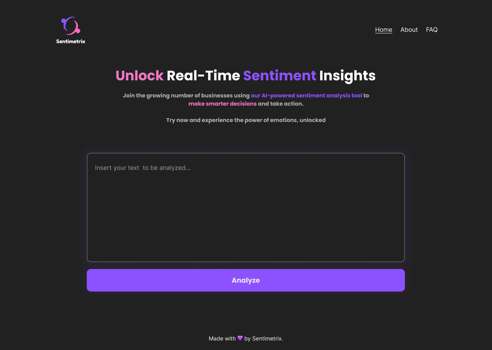

# Sentimetrix



Sentimetrix is a powerful sentiment analysis tool that uses AI-powered algorithms to provide businesses and organizations of all sizes with real-time insights into their audience's sentiment. By categorizing opinions, attitudes, and emotions from various sources, including social media, customer feedback, and online reviews, Sentimetrix empowers businesses to make informed decisions and take action with confidence.

## Table of contents

- [Sentimetrix](#sentimetrix)
  - [Table of contents](#table-of-contents)
  - [Features](#features)
  - [Getting started](#getting-started)
  - [Usage](#usage)
  - [Installation](#installation)
  - [Contributing](#contributing)
  - [License](#license)

## Features

- Real-time sentiment analysis with AI-powered algorithms
- Categorization of opinions, attitudes, and emotions from various sources
- Clear and comprehensive understanding of your audience's emotions
- User-friendly and intuitive dashboard
- Ongoing updates to ensure highest level of accuracy and performance

## Getting started

To get started with Sentimetrix, simply access our website. Our team will guide you through the onboarding process and provide support as you start unlocking the power of emotions for your business.

## Usage

Sentimetrix is a web-based application that can be accessed from any device with an internet connection. To get started, simply access our website and create an account. Once you have created an account, you will be able to access the dashboard and start using Sentimetrix.

## Installation

To install Sentimetrix, simply clone this repository to your local machine.

```bash
git clone
```

```bash
pip install -r src/requirements.txt
```


## Contributing

We welcome contributions from the community! If you are interested in contributing to Sentimetrix, please contact our creators for more information at [rafaelsantana18059@gmail.com](mailto:rafaelsantana18059@gmail.com), [contact@naomilago.com](mailto:contact@naomilago.com) or [g3rley@gmail.com](mailto:g3rley@gmail.com). We are always looking for ways to improve and welcome your ideas and contributions. Thank you for your interest in Sentimetrix!

## License

Sentimetrix is licensed under the [Creative Commons Attribution 1.0 License](https://creativecommons.org/licenses/by/1.0/). Feel free to use our code and modify it as you wish. We only ask that you give us credit for our work by linking back to our website or GitHub repository. Thank you!
